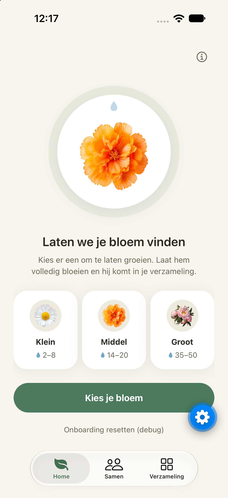
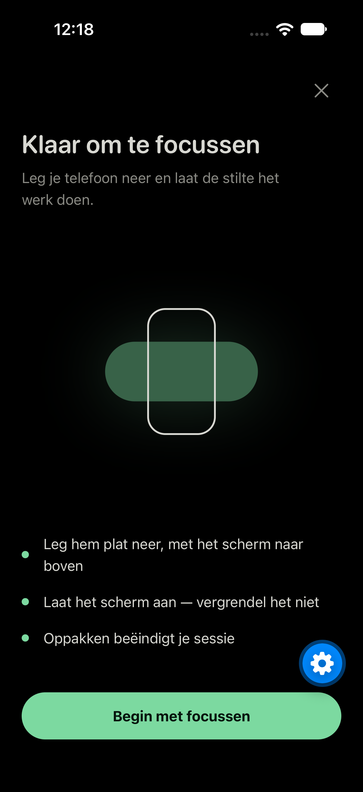
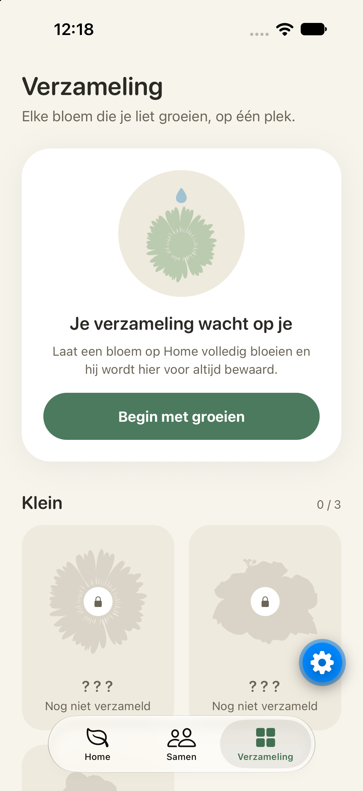
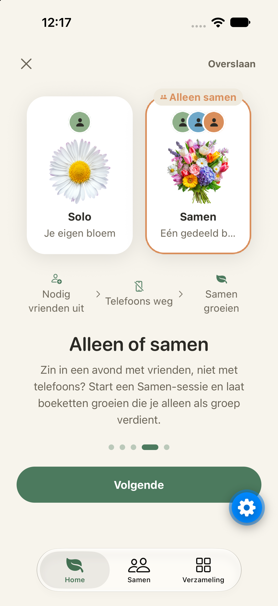

<div align="center">

# 🌱 ZenBalance

**A focus app where putting your phone down grows a flower.**

Put your phone down and your flower grows. Pick it up and the session ends.

[](https://expo.dev)
[](https://reactnative.dev)
[](https://www.typescriptlang.org/)
[](https://firebase.google.com)
[](#)

<br>







</div>

---

## What is this?

Most focus apps want your attention. In ZenBalance you do well by leaving your phone alone.

Pick a flower, start a focus session, and lay your phone flat on the table with the screen facing up. As long as the phone stays still, the session keeps running. When it finishes you earn water droplets, and those droplets grow your flower. Once it's fully in bloom, it goes into your **collection**. If you pick the phone up or switch apps, the session ends and you earn nothing.

You can also do this with friends. In a **Together** session everyone sits around the same table with their phones down, growing one shared bouquet. If anyone moves their phone, the bouquet dies for the whole group, and everyone can see who did it.

## Why it has to be a native app

The app has to know whether a phone is lying still, and it has to check that the whole time a session is running. That needs direct access to the phone's motion sensors, and a website can't do that. It only works as a real app on the phone in your hand.

## ✨ Features

- **🌼 Grow flowers by doing nothing.** Stay still for a whole session to earn droplets. When a flower has had enough water, it blooms and goes into your collection.
- **⏱️ Choose your session length.** Pick 10, 25, 45 or 60 minutes. Longer sessions earn more droplets (1, 3, 5 or 7).
- **🌸 Small, medium and large flowers.** Seven solo flowers, from a daisy that blooms in a couple of sessions to a dahlia that needs 50 droplets.
- **🗂️ A collection.** Every flower you've grown is saved, sorted by size. Flowers you haven't unlocked yet show up as locked silhouettes to aim for.
- **🤝 Together sessions.** Host a session and share a short 5-letter invite code (letters that are easy to mix up aren't used, so it's easy to read out loud). Friends join, the host picks a bouquet, and everyone's timers stay in sync through Firestore.
- **💐 Bouquets you can only grow together.** Four group bouquets, for 1, 1.5 or 2 hours of phones-down time, can only be earned in a Together session.
- **🌑 A true-black session screen.** While a session runs the screen has to stay on, so it uses a pure-black, AMOLED-friendly design.
- **📳 Early warnings.** A small nudge from the phone triggers a warning cue before it counts as a real pickup, so one bump on the table doesn't end your session.
- **🌍 Dutch and English.** A short animated tutorial on first launch, in your device's language by default. You can replay it any time from Home.

## 🧠 How it works

1. **Pick a flower and a duration** on the Home tab.
2. **Lay your phone down.** The ready screen asks you to put it flat, screen up, and to leave the screen on.
3. **Stillness detection.** Every 250 ms the app reads the accelerometer and compares the full (x, y, z) reading with a slowly updating baseline. Only two readings in a row above the movement threshold count as a pickup, so one short spike isn't enough. Sending the app to the background also ends the session.
4. **Finish and earn droplets.** A completed session adds droplets to your flower. At full bloom the flower is collected, you get a reveal screen, and your pot is free for a new flower.
5. **Together:** every device follows the same Firestore document. The host's start time, taken from the server clock, drives everyone's countdown. After a 10-second lead-in to put phones down, the first person to move ends the bouquet for the whole group.

## 🛠️ Tech stack

| | |
|---|---|
| **Framework** | [Expo](https://expo.dev) SDK 57 (React Native 0.86), [Expo Router](https://docs.expo.dev/router/introduction/) with native tabs |
| **Language** | TypeScript |
| **State** | [Zustand](https://github.com/pmndrs/zustand), saved on the device with `AsyncStorage` |
| **Sensors & device** | `expo-sensors` (Accelerometer), `expo-haptics`, `expo-keep-awake`, `expo-localization` |
| **Together sessions** | Firebase (Cloud Firestore), `@react-native-community/netinfo` |
| **UI & motion** | `react-native-reanimated`, `@shopify/flash-list`, `expo-image`, `expo-symbols` |

## 🚀 Getting started

### Prerequisites

- [Node.js](https://nodejs.org/) and npm
- A **physical** iOS or Android device with [Expo Go](https://expo.dev/go). The accelerometer doesn't work in a simulator.
- *(For Together sessions)* a Firebase project with Cloud Firestore enabled

### Installation

```bash
git clone https://github.com/IanBakeland/ZenBalance.git
cd ZenBalance
npm install
```

### Firebase setup (Together sessions)

Copy the example env file and fill it in with your Firebase web app config (**Firebase console → Project settings → Your apps**):

```bash
cp .env.example .env.local
```

```env
EXPO_PUBLIC_FIREBASE_API_KEY=
EXPO_PUBLIC_FIREBASE_AUTH_DOMAIN=
EXPO_PUBLIC_FIREBASE_PROJECT_ID=
EXPO_PUBLIC_FIREBASE_STORAGE_BUCKET=
EXPO_PUBLIC_FIREBASE_MESSAGING_SENDER_ID=
EXPO_PUBLIC_FIREBASE_APP_ID=
```

Solo sessions and the collection work without Firebase. Only the Together tab needs it.

### Running the app

```bash
npm start
```

Scan the QR code with Expo Go on your phone. To test quickly, pick the **10-second** session length and the **daisy**: two short sessions take you through growing and collecting a flower. The **sweet peas** bouquet does the same for Together, with a 30-second session.

## 📁 Project structure

```
src/
  app/
    _layout.tsx          # root: onboarding or the main tabs
    onboarding/          # first-launch language picker + tutorial
    (tabs)/
      (home)/            # flower view, flower picker, duration picker, tutorial replay
      together/          # host / join, and the [code] lobby
      collection/        # every collected flower, plus a [id] detail screen
    session/             # ready screen, solo session, Together session
  components/            # PlantView, TutorialScenes, FlowerRevealModal, themed components, tab bar
  constants/             # theme tokens (incl. the AMOLED session palette)
  data/                  # Plants.ts, SessionDurations.ts
  hooks/                 # Zustand store, useStillnessDetector, useSessionTimer, useTogetherSession
  lib/                   # Firebase setup, Together session logic, haptics
  locales/               # en.json, nl.json
assets/
  flowers/               # flower illustrations
```

For the full build plan and design system, see [`docs/PROJECT_PLAN.md`](./docs/PROJECT_PLAN.md) and [`docs/STYLE_GUIDE.md`](./docs/STYLE_GUIDE.md).

## 🎓 About

ZenBalance is a solo student project for a React Native / Expo course. It tries out a focus app built around what a phone can do natively (motion sensors, haptics, a screen that stays on), instead of a to-do list with a timer added on.

## 📄 License

This project uses the [MIT License](LICENSE).
